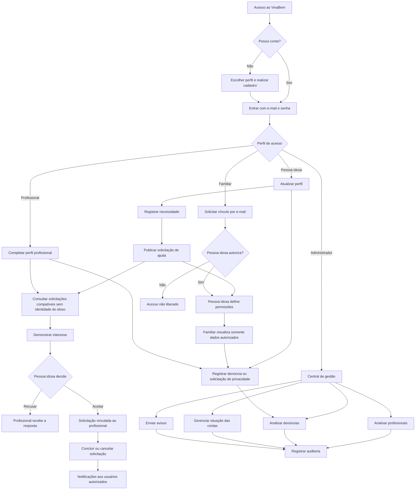

# Fluxograma geral do VivaBem

## Leitura do fluxo

O acesso começa pelo cadastro ou login. Depois da autenticação, cada pessoa segue apenas as
ações permitidas ao seu perfil. Vínculos familiares dependem de autorização e permissões
específicas. O profissional visualiza a solicitação sem receber a identidade da pessoa idosa
antes do interesse ser aceito. Decisões administrativas importantes geram auditoria.
